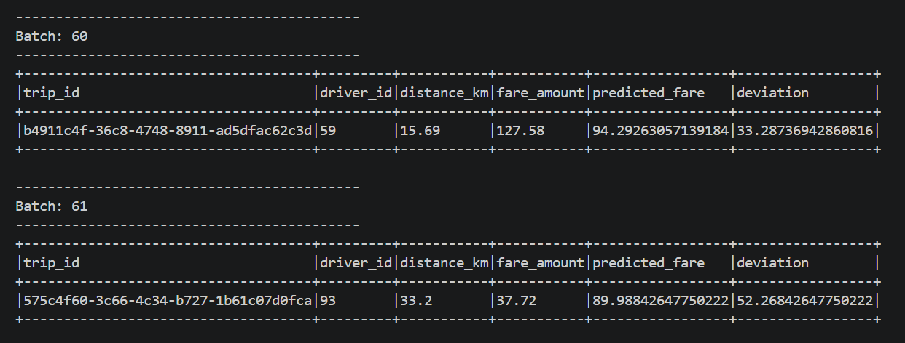
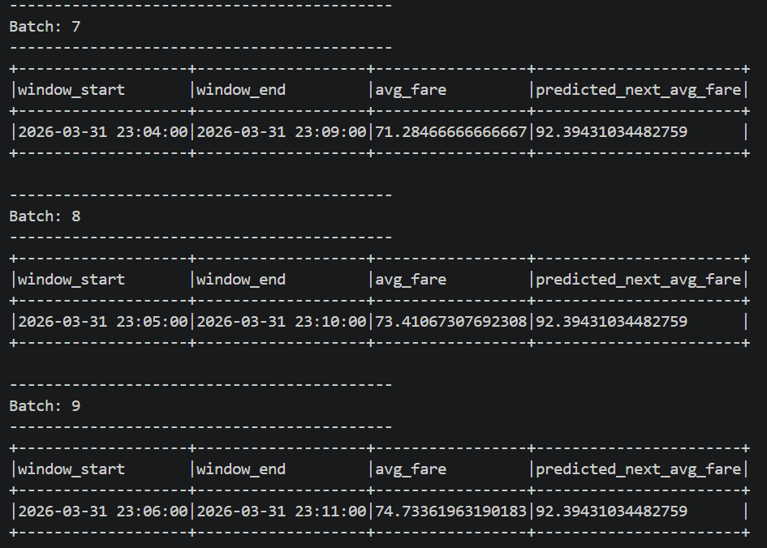

# Hands-on L10: Spark Structured Streaming + Machine Learning with Mlib
In this hands-on, you will use GitHub Codespaces and continue working on real-time analytics pipeline for a ride-sharing platform using Apache Spark Structured Streaming. You will process streaming data, implement machine learning algorithms, and predict various features. The workflow consists of:

•	A Python script that simulates real-time ride-sharing data.

•	Apache Spark (Structured Streaming) to read, clean, and analyze the incoming data.

•	Spark Mlib to train Machine learning models and predict features.

Previously we worked on Tasks 1, 2, 3 now Your assignment is divided into two tasks:

•	Task 4: Real-Time Fare Prediction Using Mlib Regression.

•	Task 5: Time-Based Fare Trend Prediction.

## Output Screenshots: 

Task 4: 

Task 5: 

## Explanations/Approach:  

Dataset: You will work with a data generator python script that continuously streams data.
Perform the following tasks: 

Task 4: Basic Streaming Ingestion and Parsing
1.	Offline Model Training: A LinearRegression model is trained using a static CSV file (training-dataset.csv). The model learns the relationship between distance_km (the feature) and fare_amount (the label). The trained model is then saved to disk.
2.	Real-Time Inference: The script ingests live ride data from the socket. For each incoming ride, it uses the pre-trained model to predict the fare based on the trip's distance. It then calculates the deviation between the actual fare and the predicted fare to identify potential anomalies.
Instructions:
•	Load the training data from training-dataset.csv.
•	Use VectorAssembler to prepare the feature column (distance_km).
•	Create and fit a LinearRegression model to the training data.
•	Save the trained model to a local path (e.g., models/fare_model).
•	In the streaming logic, load the saved model.
•	Apply the model to the streaming DataFrame to generate a prediction column.
•	Compute a deviation column by calculating the absolute difference between fare_amount and prediction.
•	Print the results, including the deviation, to the console using outputMode("append"). 

 
Task 5: Time-Based Fare Trend Prediction
1.	Offline Model Training: The training data from training-dataset.csv is first aggregated into 5-minute windows, calculating the avg_fare for each. Instead of using a raw timestamp, we perform feature engineering, creating cyclical features like hour_of_day and minute_of_hour from the window's start time. A Linear Regression model is trained on these features and saved.
2.	Real-Time Inference: The live stream is aggregated using the same 5-minute windowing logic. The same hour_of_day and minute_of_hour features are created for each window. The pre-trained model is then used to predict the avg_fare for that time window.
Instructions:
•	Load the training data from training-dataset.csv.
•	Pre-process the training data by grouping it into 5-minute windows and calculating the avg_fare. 
•	Create hour_of_day and minute_of_hour features from the window.start time.
•	Train a Linear Regression model on these features and save it (e.g., to models/fare_trend_model_v2).
•	For the streaming data, apply the same 5-minute windowed aggregation and feature engineering steps. 
•	Load the saved model and apply it to the aggregated streaming DataFrame.
•	Print the window_start, window_end, actual avg_fare, and predicted_next_avg_fare to the console.

## Results: 

The results for both tasks can be found in the outputs folder. 

